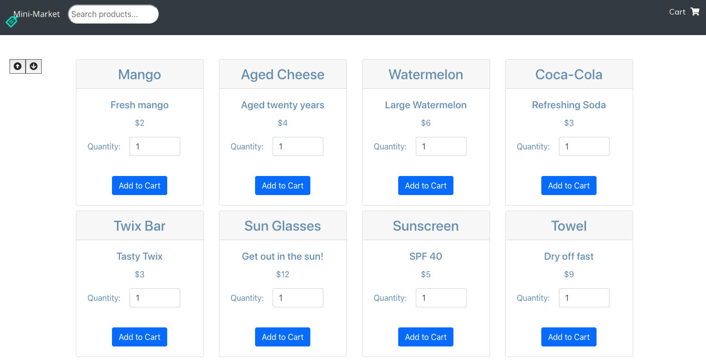

# Mini-Market

This is a small React application, made the purpose of demonstrating understanding of React concepts 

Welcome to the Mini-Market! Summer is just around the corner and it's time to get ready.
--
To start up the app, use the instructions directly below:
--

### `git clone git@github.com:cews7/mini-market.git`
First, let's clone the project into a local directory.

### `cd into mini-market`
Next, let's go into that app's directory.

### `npm install`
This will give us our needed dependencies to run the Mini-Market

### `npm start`
We're ready to go, let's see the Mini-Market!
Open [http://localhost:3000](http://localhost:3000) to view it in the browser.

